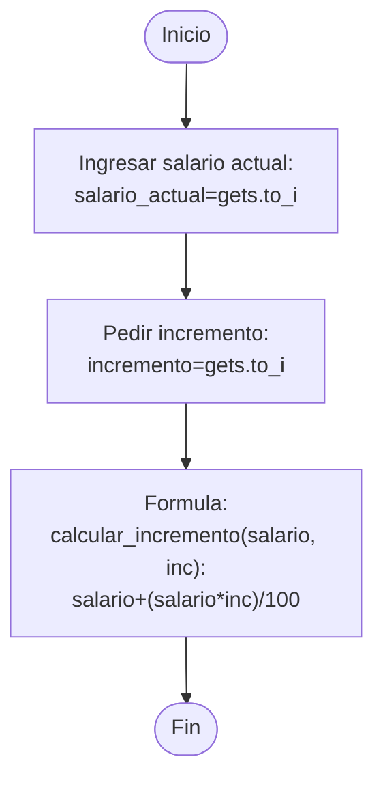

## Calcular nuevo salario 

```mermaid
%%{init: {"flowchart": {"htmlLabels": false}} }%%
flowchart TB
	inicio([Inicio])
	--> paso1[Ingresar salario actual:\nsalario_actual=gets.to_i]
	--> paso2[Pedir incremento:\nincremento=gets.to_i]
	--> paso3["Formula:\ncalcular_incremento(salario, inc):\nsalario+(salario*inc)/100"]
	--> fin([Fin])
	
```
